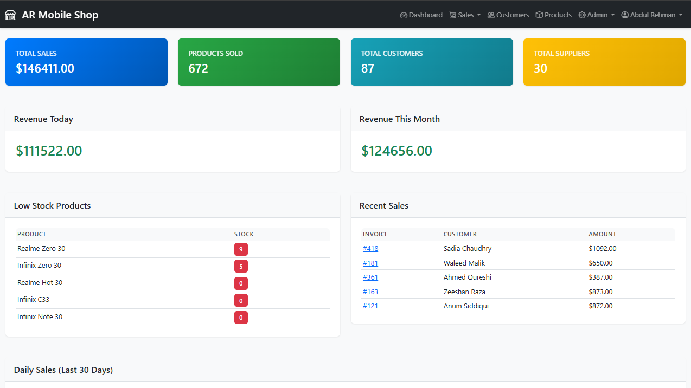
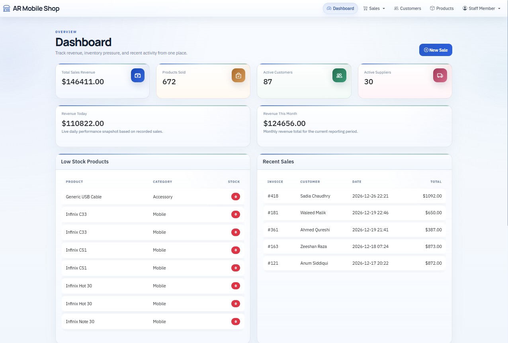
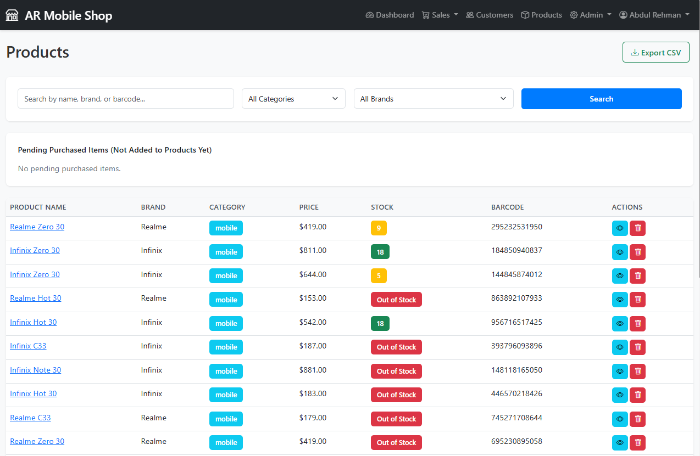
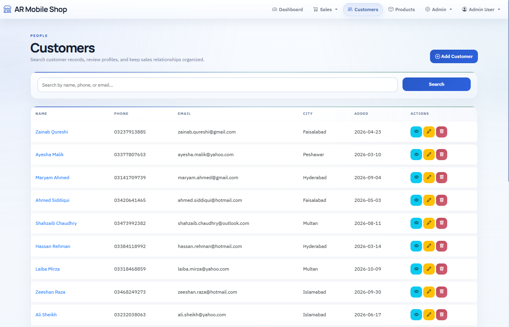
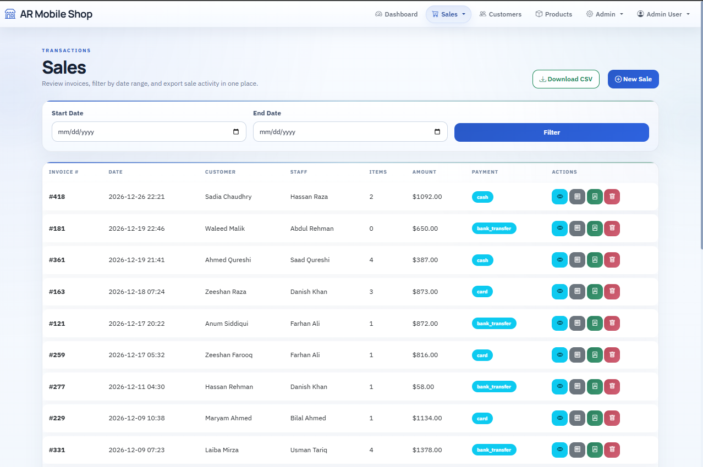
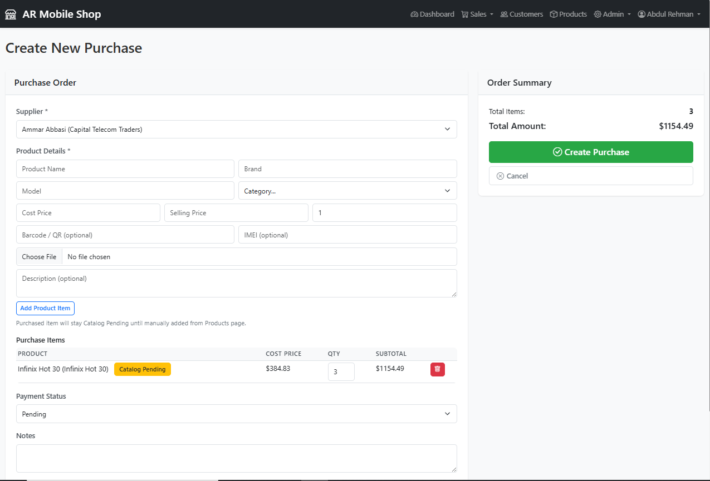
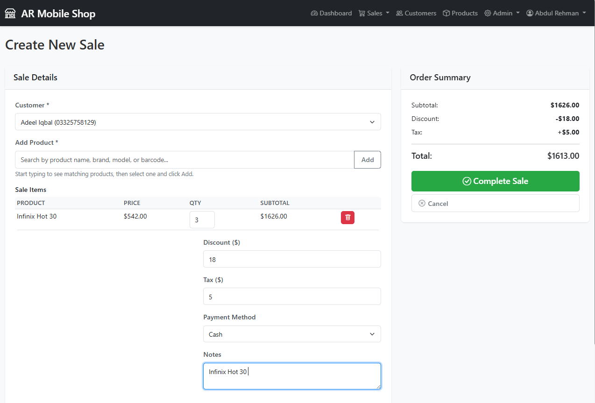

# AR Mobile Shop

Flask-based sales and inventory management system for a mobile shop. The app manages products, customers, suppliers, purchases, sales, stock movement, and dashboard reporting.

## Portfolio Summary

AR Mobile Shop is a modular Flask application built to manage a mobile retail business end to end. It covers sales, purchases, stock tracking, customer records, supplier management, role-based access, and operational reporting in a single system.

## Highlights

- Role-based authentication for `admin` and `staff`
- Product catalog with pricing, barcode, IMEI, and image upload
- Purchase workflow with supplier tracking and stock increases
- Sales workflow with multi-item invoices and stock deduction
- Customer and supplier management
- Dashboard reports with Chart.js
- CSV exports for sales and inventory
- CSRF protection and signed API token checks for JSON endpoints
- Alembic migrations via Flask-Migrate

## Role Access

- `Admin` can manage suppliers, purchases, reports, products, and staff accounts.
- `Staff` can work on day-to-day sales and customer operations, but product management, supplier setup, purchase management, reports, and staff creation are restricted to admin users.

## Tech Stack

- Flask 3
- SQLAlchemy
- Flask-Login
- Flask-WTF
- Flask-Migrate / Alembic
- SQLite
- Jinja2
- Bootstrap 5
- Chart.js

## Project Structure

```text
Mobileshop/
|-- app/
|   |-- auth/
|   |-- customers/
|   |-- dashboard/
|   |-- products/
|   |-- purchases/
|   |-- sales/
|   |-- suppliers/
|   |-- static/
|   |-- templates/
|   |-- utils/
|   |-- __init__.py
|   |-- extensions.py
|   |-- models.py
|-- docs/
|-- migrations/
|-- config.py
|-- requirements.txt
|-- run.py
|-- .env.example
```

`instance/` is created locally at runtime for the SQLite database and is intentionally not committed to GitHub.

## Setup

### 1. Create and activate a virtual environment

```powershell
python -m venv venv
.\venv\Scripts\activate
```

### 2. Install dependencies

```powershell
pip install -r requirements.txt
```

### 3. Configure environment variables

```powershell
copy .env.example .env
```

Update `.env` with a real secret key.

Example:

```env
FLASK_APP=run.py
FLASK_ENV=development
SECRET_KEY=replace-with-a-long-random-value
DATABASE_URL=sqlite:///instance/mobile_shop.db
UPLOAD_FOLDER=app/static/uploads
MAX_CONTENT_LENGTH=16777216
```

### 4. Run migrations

```powershell
flask db upgrade
```

### 5. Optional: bootstrap admin and staff accounts

```powershell
flask init-db
```

If `ADMIN_PASSWORD` or `STAFF_PASSWORD` are not set, the command generates random passwords and prints them in the terminal.

Optional custom credentials:

```powershell
$env:ADMIN_EMAIL="admin@example.com"
$env:ADMIN_PASSWORD="ChangeThisPassword"
$env:STAFF_EMAIL="staff@example.com"
$env:STAFF_PASSWORD="ChangeThisToo"
flask init-db
```

### 6. Run the application

```powershell
python run.py
```

Open:

```text
http://127.0.0.1:5000
```

## Main Modules

### Authentication

- Login
- Logout
- Change password
- Admin-only staff account creation

### Products

- View catalog products and move pending purchased stock into the catalog
- Upload product images during purchase intake
- Track stock, barcode, IMEI, and pricing
- Export filtered product/inventory data to CSV

### Sales

- Create multi-item sales
- Server-side pricing enforcement
- Invoice view and print-friendly output
- Filter and export sales to CSV

### Purchases

- Record supplier purchases
- Increase inventory automatically
- Track payment status

### Customers and Suppliers

- CRUD screens
- Search and filtering
- Linked sales and purchase history

### Dashboard and Reports

- Revenue summary cards
- Sales and stock charts
- Recent activity

## Screenshots

### Admin Dashboard



### Staff Dashboard



### Products



### Customers



### Sales List



### Create Sale



### Sale Item Flow



## Security Notes

- Production mode requires a real `SECRET_KEY`
- CSRF protection is enabled
- Passwords are hashed with Werkzeug
- Signed API tokens are used on protected JSON actions
- Do not commit `.env`, `instance/`, or uploaded media

## GitHub Release Notes

Before pushing publicly, make sure these are not committed:

- `.env`
- `instance/`
- `app/static/uploads/` if they contain private or local-only media

## Troubleshooting

### `SECRET_KEY must be set in production`

Either:

- set `SECRET_KEY` in `.env`, or
- run locally with `FLASK_ENV=development`

### `unable to open database file`

Check that:

- `instance/mobile_shop.db` exists, or
- `DATABASE_URL` points to a valid writable SQLite path

### Charts not appearing

Check that:

- `app/static/vendor/chart.min.js` exists
- browser console has no JS errors

## Portfolio Readiness

The app is organized as a modular Flask project with clear business domains, role separation, and migrations. The included screenshots make the project easier to review as a portfolio piece.
